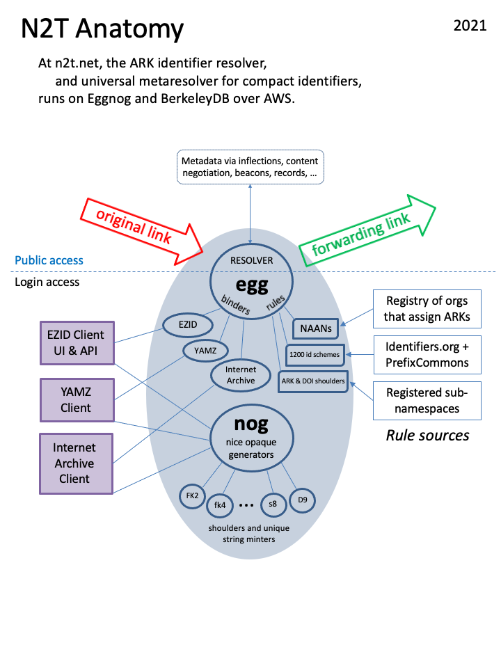

# N2T Operations

### Overview

This document is meant to help CDL technical staff who may not be familiar 
with the N2T service to perform basic maintenance on it.

N2T provides minting, binding, and resolution services with ARK and DOI
identifiers for several clients, the most important of which is the EZID
service.  While N2T supplies its primary backend storage, EZID is
managed as a separate, independent service (see [EZID
Operations](https://confluence.ucop.edu/display/UC3/EZID+Operations) \--secured).
Other clients, used mainly for resolution, include the Internet Archive\'s
Open Content Alliance (OCA) and the YAMZ metadictionary. Per an MOU with
the EMBL-EBI, on a daily basis N2T harvests \"prefix\" records from
Identifiers.org to support \"compact identifiers\".

All functions are served from an Apache web server homed at
[n2t.net](https://n2t.net).  
The N2T web server runs under Amazon Web Services (AWS).  A typical
instance is an Amazon Linux AMI using the open-source Eggnog package
(formerly Noid) to mint, bind, and resolve identifiers. Egg is for
binding (storing) and resolving, and nog (nice opaque generator) is used
for minting. 

Eggnog is written in Perl and uses the open-source
BerkeleyDB software as a fast, scalable database. Resolution is provided
by Apache server rewrite rules hooked up to egg binders. Also on N2T are
administrative scripts written in Bash for creating and managing
identifier prefixes (shoulders), backing up the database, updating
replica servers, as well as documents to support these functions.



### Instance Classes

There are dev, stg, and prd instance classes of N2T running under Linux2 on
CDL-managed AWS infrastructure.

The Linux environments in which these instances run (the filesystems,
role accounts, permissions, package dependencies, etc.) are mostly
identical except for slight configuration differences as indicated in
the table below. Normal practice is for all instances to run the same
version of the N2T code, the typical exception being when a dev instance
is temporarily ahead of stg, or stg is temporarily ahead of prd. At CDL
the dev and stg instances should be kept in running order because they
participate in semi-production prefix harvesting validation exercises.

Each instance is maintained by pulling code from github, building, and 
testing, and installing. One overall eggnog_conf yaml file that lives on every instance 
contains an overview of all instance classes (dev, stg, prd, and "local" 
(eg, laptop)). An instance "knows" what class it belongs to because of one
of a handful of environment variables set in ~n2t/warts/env.sh.

|                |   **prd**   |   **stg**   |   **dev**   |
| :------------: | :---------: | :---------: | :---------: |
| N2T API and UI | n2t.net     | n2t-stg.n2t.net | n2t-dev.n2t.net |
| internal name  | ids-n2t2-prd.n2t.net | ids-n2t2-stg.n2t.net | ids-n2t2-dev.n2t.net |
| updated by API | yes         | yes         | yes         |
| resolver check | yes         | yes         | yes         |
| binder backups | yes         | no          | no          |


To bring up N2T \"from scratch\" on a brand new host, copy over the script
from ~n2t/n2t_create/ec2_bootmake and run it.

### Common filesystem layout

All instances of N2T have the same filesystem layout, although there are
certain directories and binders (databases) that are used regularly only
on the prd instance.  For example, the production directories that used to
support shoulder creation, replication, backups, and logging are only
found on the production instance; no attempt is made to
synchronize such directories.  The result is that, on non-production
instances, binders and directories designed to hold data, are often
contain historical data or test data.

In the filesystem names below, a terminal \'**/**\' indicates a directory.
There are a number of helper shell (bash) variables that come with a default
installation and provide shortcuts (eg, \$sa, \$se, \$sn, \$sv, \$she).
A role account of **n2t** is assumed, so that **~** is equivalent to **~n2t**.

-   **\~n2t/** (role account home directory)
    -   **.bashrc** (PATH, helper aliases, variables, and functions)
    -   **.svudef** (defines important (for now) "svu" function)
    -   **init.d/apache** (service control script)
    -   **sv/cur/** aka **\$sv** (service version: current; contains all
        system dependencies \-- type \"svu\" to read more)
        -   **apache2/** aka **\$sa** (root of main Apache web server,
            all built by **build_server_tree**)
            -   **binders/, minters/, shoulders/** (binders, minters,
                and shoulders, symlinked to from home directory)
            -   **eggnog_conf** (critical service configuration file 
                that specifies behavior of all instance classes, queried
                with "n2t <binder> cfq", eg, `n2t oca cfq _list`)
            -   **prefixes.yaml** (critical file with overview of all
                prefixes (schemes, NAANs, shoulders) known to N2T
                resolution)
            -   **htdocs/a/** (root of all API calls; examples below)
                -   **ezid/b** (link to script servicing API calls to
                    the \"ezid\" main binder)
                -   **ezid_test/b** (link to script servicing API calls
                    to the \"ezid\" test binder)
                -   **ezid/m** (link to script servicing API calls to
                    \"ezid\" minters)
                -   **ezid/rmap_ezid** (long-running script that
                    resolves from the \"ezid\" main binder)
                -   **oca/b** (link to script servicing API calss to the \"oca\" main binder)
                -   ... etc.
            -   **htdocs/e/** (root of all extras, eg, documentation)
            -   **logs/access_log.*YYYY.MM.DD*** (logging web accesses,
                including resolution)
            -   **logs/transaction_log** (logging unified view of
                N2T system activity -- current file)
            -   **logs/transaction_log.*YYYY.MM.DD*** (older logs)
            -   **logs/error_log.*YYYY.MM.DD*** (combined rewrite and error log, used mostly for
                debugging, eg, resolution)
            -   **pfx/** (prefix harvesting, importing, building, testing)
        -   **bin/** (all commands that N2T depends on)
            -   **egg** (binder commands \-- type \"egg\" to read more)
            -   **nog** (minter commands \-- type \"nog\" to read more)
            -   **db_dump, db_hotbackup, db_verify,** etc (Berkeley DB
                utilities)
            -   **perl, python, hg, anvl, pt,** and many other commands
        -   **build/** (sources for all dependencies, all built
            by **n2t_create/make_instance**)
        -   **build/eggnog/** (an hg repo: main system sources for
            **egg, nog, build_server_tree** and more)
    -   **sv/new/, sv/old/**  (other service version symlinks -- unused)
    -   **sv/cv0/, sv/cv1/, \... sv/cv9/** (actual service \"code\"
        versions, pointed to by cur, new, and old symlinks -- generally doesn't change)
    -   **binders/** (all binders in the current service version)
        -   **egg_n2t_prd_public.real_ezid_s_ezid/** (main binder, EZID populator)
            -   **egg.bdb** (BerkeleyDB binder database for EZID)
        -   **egg_n2t_prd_public.real_ezid_s_ezid_test/** (EZID test binder)
        -   **egg_n2t_prd_public.real_oca_s_oca/** (main binder, OCA populator)
            -   **egg.bdb** (BerkeleyDB binder database for EZID)
        -   egg_n2t_prd_public.real_oca_s_oca_test/ (OCA test binder)
        -   **yamz/** (main binder for the YAMZ populator, also has test binder)
    -   **minters/** (all minters in the current service version)
        -   **ezid/ark/** (minters for all of EZID\'s ARKs and DOIs)
            -   **13030/** (shoulder minters for CDL ARKs)
            -   **b5072/** (shoulder minters for 10.5072 DOIs)
                -   **fk2/** (minter directory for fake DOIs)
                    -   **nog.bdb** (minter BerkeleyDB database for fake DOIs)
            -   **c3010/** (shoulder minters for 10.13010 DOIs
            -   \... and many other NAANs with minters
        -   **oca/ark/** (shoulder minters for Internet Archive ARKs)
            -   **13960/t/** (minter for OCA ARKs)
        -   **yamz/ark/** (shoulder minters for YAMZ ARKs)
            -   **99152/h/** (minter for YAMZ ARKs)
    -   **naans/** (all ARK NAAN management in the current service
        version)
        -   **master_naans** (text file containing NAAN registry)
    -   **shoulders/** (obsolete -- now maintained at EZID)
    -   **backups/** (regular binder backups)
    -   **logs/** (collection of symlinks and system admin logs)
    -   **local/bin/** (system scripts maintained in
        **n2t_create**; examples below)
        -   **svu_run** (implements the \"svu\" bash function, setting
            PATH, prompt, etc)
        -   **wegn** (command line web client for exercising this N2T
            instance \-- type \"wegn\" to read more)
    -   **n2t_create/** aka **\$sn** (separate repo: source for scripts
        that maintain the n2t role account and system, and build both
        from scratch)
        -   **make_instance** (script to rebuild some or all system
            dependencies, with \"**svu new**\" in effect)
        -   **ec2_bootmake** (script to build new system from scratch,
            finishing with call to \"**make_instance build all**\")
        -   **skel/** (source for establishing role account from
            scratch: basic directories, startup files, generic warts
            files)
    -   **README** (summary of role account home directory)
    -   **warts/env.sh** (sets instance-specific environment variables)
    -   **warts/ssl/** (SSL/TLS certs go here)

When \"**svu cur\"** is in effect, \$PATH is modified by prepending the
current service \"bin\" directory to it, and \$PERL_INSTALL_BASE is
similarly modified.  Other useful things are defined as well, including

```
# Some aliases that make n2t/eggnog development and testing easier.
#
alias blib="perl -Mblib"
# $PERL_INSTALL_BASE interpolated at run time, eg, when "svu cur" in effect
alias mkperl='perl Makefile.PL INSTALL_BASE=$PERL_INSTALL_BASE'
```

### Administration: starting & stopping

Administering N2T is done while logged in to the \"n2t\" role account.
The following script provides the basic controls:

```
~/n2t/init.d/apache [ start | stop | restart | status ]
```

Another script, `/etc/init.d/apache.n2t`, calls this script on machine
boot and shutdown.

For maintenance downtimes that you expect to last (or that end up
lasting) over a minute, it is best to suspend Nagios (or whatever monitoring
system you use; see [Administration: monitoring](#N2TOperations-admin-monitoring))
using, for example, the \"scheduled downtime\" menu selection, so that
other staff won\'t be inconvenienced by unnecessary alerts.

### Administration: server status

The status of the production N2T server can be viewed by logging in via
ssh to `n2t@ids-n2t2-prd.n2t.net` and running

```bash
$ ~/init.d/apache status
success: N2T is up
```

The underlying API method is described in the API documentation, which
can be viewed at [The N2T API](http://n2t.net/e/n2t_apidoc.html).

### Administration: resolver status

Information about a long-running Perl process that handles all ARK
resolution can be viewed from any browser by trying to resolve
`ark:/99999/__rrminfo__`. This is a special ARK (an easter egg), that
asks for information from the binder via \"rewritemap resolver mode\"
(the long-running process), and it returns a fake URL destination. For
example, to query the production instance,

```
$ wget -O - n2t.net/ark:/99999/__rrminfo__ 2>&1 | grep Location
Location: http://www.example.com/embrpt/1.00/1.83/4.007025/4.7/11598/2015.02.21_23:11:51?\
dvcsid=9e1430c24de8&rmap=/apps/n2t/sv/cv2/apache2/htdocs/a/ezid/rmap_ezid
[following]
```

Entered into a regular browser, the special ARK will appear to fail, but
the actual information you want will be conveyed in the text of the URL
displayed in the location bar. In the URL path will be found version
numbers for (using \"embrpt\" as mnemonic) **e**gg,
BerkeleyDB **m**odule, **b**uilt with which BDB C library, and
**r**unning dynamically linked against which BDB C library, followed
by **p**rocess id and build **t**ime.  In the query string will be found
the changeset id (dvcsid), and script name (rmap).

### Administration: pausing the server

While there is currently no straightforward way to pause N2T, there are
some actions (from the n2t role account only) that effectively pause all
write operations on a binder, such as when a backup is done (`egg -d
ezid dbsave ...`). You can artificially pause a binder from the role
account via a terminal window by running, for example, `egg -d ezid
--lock dbinfo all | more`, leaving the `more` pager output on the first
page, and unpause it by quitting the pager.

### Administration: patching the operating system

Installing operating system updates (often needed for security reasons)
consists of a patching step, an optional machine reboot step, and a
testing step.

1.  *Patching step*.  AWS patching is encapsulated in `admegn
    sysupdate`, which ultimately calls `sudo yum update`.

2.  *Rebooting step.*  If a reboot is required, the safest way to
    prepare for it in the current production configuration, is to start
    no sooner than 1 minute after the beginning of the advertised
    maintenance window, giving customer processes that observe the same
    window a chance to finish pausing.  In addition, because the
    production instance is a single EC2 instance, it is best to avoid
    system downtime when an EC2 healthcheck comes in.  So on the
    production host, use `admegn pingwhen` to observe the periodicity
    of the monitoring health checks (look for \"WebInject\") and time
    your reboot to happen just after the next check.  If a check comes
    in when the system is down, the greater the chance of the instance
    being taken out of load balancer rotation and the greater the
    apparent downtime to users.  The following reboot procedure is advised.

    -   window A: open ssh session into production instance
    -   window B: a non-production machine from which you
        will initiate the reboot

        1.  To start (if patching, do that first, then), from window A
            understand when the healthchecks occur.  Note that by current
            local AWS policy, the \"WebInject\" healthchecks may be
            suspended during EZID\'s standard maintenance period; if so this
            step may not be necessary (also reboot time has shortened
            recently from 90 to 20 seconds, which further reducesconcerns).  
            `admegn pingwhen    # look for the timing of "WebInject" checks`  
            `admegn pingwhen    # verify latest check`

        2.  From window B, initiate and monitor the reboot, to let you know
            when the system is back up and how long it was down.  
            `admegn bootwatch ids-n2t2-prd.n2t.net n2t.net   # reboots remote system`  
            Keeping an eye on window B during this time, verify that the ssh
            session in window A has disconnected.

3.  *Testing step*.  An important test of whether EZID is working is to
    create a demo ARK at ezid.cdlib.org from a browser window and watch
    the `ezcl p ...` monitor output until the binder queue drains (you
    can use the `eztest` CLI script for this instead). If that test
    fails, try to visit n2t.net from a browser window, and log back in
    to production in window A to run post-reboot tests from the shell.  
    `n2t test       # test script (some failed tests may be normal)`

### Administration: monitoring

There are several sources of system monitoring that have been set up
manually.  All sources notify of outages but take no action themselves.

1.  From CDL, monitoring of CDL hosts is managed by Nagios, with email
    notification going to the developers' email addresses.
2.  From monitor.us (a free monitoring service), outage notifications
    for the primary and replica instances are sent to jak\@ucop.edu.
3.  From statuscake.com (another free monitoring service, outage notifications
    are sent to jak\@ucop.edu.
    
For CDL monitors, action is required because CDL and UCOP staff pay
close attention to service faults and will take steps to restart the
service themselves unless you formally "acknowledge" the faults.

An easy way to acknowledge a fault is to reply to the emailed CDL Nagios
notification, but for this must be done from CDL Outlook mail (eg, not gmail),
making the first line of the reply of this form:

```ACK I am working on this. -John ENDACK```

Alternatively, you may login to Nagios at
<https://cdl-aws-nagios.cdlib.org/> with your dev/stg (UCOP CDL LDAP)
credentials, select Hosts from the left pane, select the specific host
that faulted (n2t\*), and select "Acknowledge\..." from the Service
Commands pane.

If a service is purposely taken offline, communicate that fact
formally per instructions documented in the [CDL Nagios User\'s
Guide](https://confluence.ucop.edu/display/CUG/Nagios+User's+Guide).

### Administration: contacts and after-hours IT help

For after-hours help with the CDL instances, contact the UCOP ITS
Helpdesk at helpdesk\@ucop.edu or 510-987-0349. If urgent help is needed
to correct a serious problem, follow this procedure.

-   Call 510-987-0349 to describe the problem, ask the person to contact
    the \"UNIX On-Call Technician\", and have them call you at a number
    where you can be reached.
-   After hanging up, notify CDL\'s IAS Service Manager.
-   After hanging up, send email to helpdesk\@ucop.edu
    to create a written record of the contact.

### Source code

The source code is managed in six github repos: one for the eggnog
package, one for administration and initialization (n2t_create),
and four for separate Perl modules (a little newer than their CPAN 
counterparts).

-   n2t-eggnog repository
    -   Purpose: main software (Perl and Bash) behind the N2T service
    -   Central repository URL: <https://github.com/CDLUC3/n2t-eggnog>
    -   Local filesystem: **\~/sv/cur/build/eggnog**
    -   Description: egg, nog, and anvl2egg commands, plus various Perl
        modules, config files, Bash scripts, and numerous test suites

-   n2t-admin repository
    -   Purpose: N2T admin and automated N2T system build
    -   Central repository URL: <https://github.com/CDLUC3/n2t-admin>
    -   Local filesystem: **\~/n2t_create**
    -   Description: creates system software stack and role account from
        scratch; populate **\~/local/bin** with numerous scripts

-   File-ANVL, File-Namaste, File-Pairtree, File-Value repositories
    -   Purpose: general-purpose supporting Perl modules (newer than
        their <https://search.cpan.org/~jak/> counterparts)
    -   Local filesystem: **\~/sv/cur/build/File-\...**  
           file-anvl <https://github.com/CDLUC3/file-anvl>  
           file-namaste  <https://github.com/CDLUC3/file-namaste>  
           file-pairtree <https://github.com/CDLUC3/file-pairtree>  
           file-value <https://github.com/CDLUC3/file-value>

-   naans repository (obsolete -- ARK Alliance manages NAANs now)

-   svu repository (obsolete -- incorporated into n2t-admin)
 
-   shoulders repository (obsolete -- EZID and ARK Alliance manage shoulders)

At system build time, N2T populator (ie, user) passwords are looked for
first in the file **\~/warts/.pswdfile.n2t** and then in
**\~/sv/cur/build/eggnog/t/n2t/pswdfile**.  Do *not* put real passwords
in the latter file, which is (a) checked into the source repository and
(b) meant to be used only for test purposes.

### Command-line tools

The egg command manages binders and the nog command manages minters. To
see the state of any binder or minter, use the `mstat` sub-command, as in

```
$ nog -d \~/minters/ezid/ark/99999/fk4 mstat
minter: /apps/n2t/minters/ezid/ark/99999/fk4
status: enabled
spings minted: 852651
spings left: unlimited
spings left before blade expansion ("add3"): 69883859
spings held: 0
spings queued: 0
template: 99999/fk4{eedeedk}
sample: 99999/fk40002f9j
original template: 99999/fk4{eedk}

$ egg -d \~/binders/ezid mstat
binder: /apps/n2t/binders/ezid
status: enabled
bindings: 58623062
```

Other command-line tools (in \~/local/bin) provide a variety of
services. Generally each tool will print help information when
given no arguments. Here are a few

-   **admegn** - admin tool for eggnog, eg, **admegn backup**
-   **n2t** - admin tool for the N2T service, eg,  
    `n2t rolltest          # install new code and run tests`  
    `n2t oca cfq backup    # returns 1 if backups to be run`
-   **pfx** - prefix harvesting, testing, installation
-   **wegn** - web eggnog client
-   **wegnpw** - fetch an N2T user\'s password
-   **bdbkeys** - fetch keys and values from one or more Berkeley DB
    databases
-   **mg** - (obsolete) mongodb server and result set management

### Procedure: code update

Imagine some code changes have been committed and pushed to github
from dev. To deploy those changes in stage:

1.  Login to `n2t@ids-n2t2-stg.cdlib.org`
2.  **cd \$sv/build/eggnog**
3.  **n2t import**
4.  **n2t rollout             \# about .5 seconds downtime**
5.  **n2t test**

If something goes terribly awry, try to rollback to the previous revision:

1.  **n2t rollback            \# not tested in a long time
2.  **n2t test**

If everything looks good, repeat the previous steps on the other N2T
instances, ending with the production instance.

If you need to install a new version of a major dependency, such as the
Perl interpreter, you will want to use \"**svu new**\" to install an
entire new service version.

1.  **cd \~/n2t_create**
2.  **svu new**
3.  **vi make_instance              \# to change the Perl version to be installed**
4.  **./make_instance build all     \# 15-25 minutes to build full stack
    of software dependencies and test thoroughly**
5.  **\... svu rollout \...           \# not all details have been tested**

### Cron jobs

There are a number of cron jobs, many controlled by settings in
`$sa/eggnog_conf`, to rotate logs, create backups, patch the OS, run
resolver checks, etc. For example, a cron job runs every few minutes 
on the primary production instance to test for resolver inconsistencies. 

### Passwords and ports

Passwords are not kept in any repo. All services require 
ports 80 and 443 be open to the world. CDL instances have ports 8082 and 8083 
open for testing, and port-forward 80 and 443 to 18880 and 18443, respectively,
so that servers can be started without root privilege. 

### Personally identifiable information and privacy

N2T stores opaque \"agent PIDs\" recorded by EZID.  Agent PIDs are
viewable only by the administrator.

The identifier operations that a populator (a service, such as EZID,
OCA, or YAMZ, not an individual) performs are recorded in N2T's
transaction log. Anonymized transaction log records may be retained indefinitely 
and are viewable only by N2T software development staff.

The Apache access log includes client/browser IP addresses.  Access log
records older than six months are removed.
